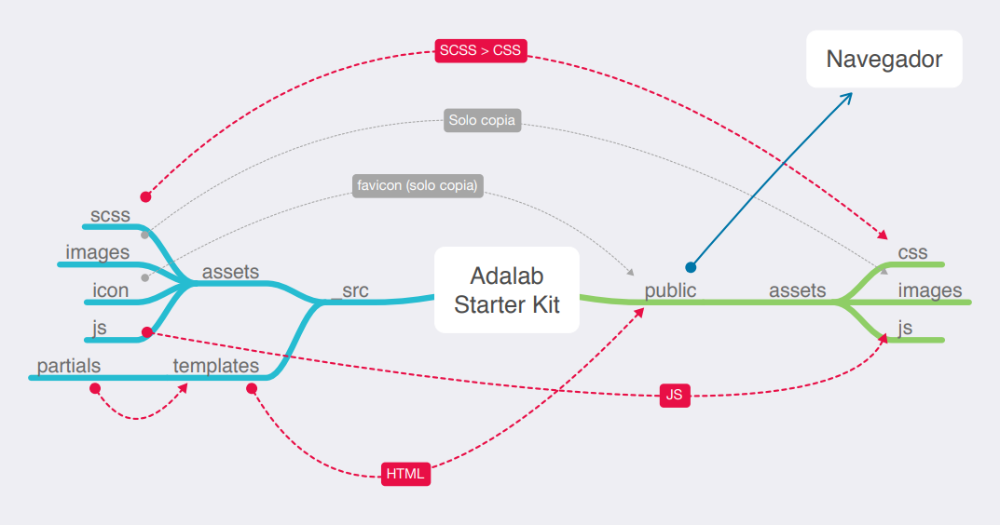

# Módulo 1: Ejercicio de evaluación final Recursos

- Antes de empezar, tenéis que crear un nuevo repositorio desde GitHub Classroom usando este enlace. Una vez creado, debéis clonarlo en vuestro ordenador y en la carpeta creada debéis empezar a trabajar en el ejercicio.
- A continuación debéis descargar e incluir en el proyecto el starter kit de Adalab.
- También necesitaréis varias imágenes e iconos que podéis descargar desde este zip.
- Y por último aquí tenéis los diseños en zeplin para guiaros en la maquetación. Si no puedes permisos para ver el proyecto, pídeselo a tu profesora.

## Enunciado

El ejercicio consiste en desarrollar una página web de acuerdo a un diseño dado. Hay que resolver varios puntos:
- Usar Sass.
- Usar flexbox y CSS Grid.
- Usar media queries.
- Resolver algunas interacciones usando transiciones.

## Maquetación

En primer lugar debéis realizar la maquetación sobre un diseño dado:

1. El botón de hamburguesa (en la esquina superior izquierda) debe estar fijo en la parte superior de la pantalla y no debe desaparecer al hacer scroll. El icono de la hamburguesa debe ser un enlace a la página de Adalab. Este menú de hamburguesa no desplega ningún submenú.

1. Primer módulo (Anonymous proxy): debe estar maquetado con flexbox y debe ocupar el alto de la ventana del navegador.

1. Segundo módulo (Looking Through A Window): se puede maquetar usando las propiedades de CSS que se deseen.

1. Tercer módulo (3 Reasons To Purchase): los 3 elementos del listado deben estar maquetados con CSS Grid en todos los tamaños de pantalla.

1. Cuarto módulo (footer): se debe maquetar usando flexbox. Todos los textos de la columna "ARTICLES" y todos los textos de la columna "TWITTER" deben ser enlaces a la página de Adalab.

### Interacción

   En total, hay 3 interacciones que resolver:
   
1. El botón de flecha del módulo hero debe enlazar a la sección "3 Reasons To Purchase".
1. El botón de flecha del footer debe enlazar al inicio de la página.
1. En el hover de los botones ("Go" y "3 Reasons To Purchase") se debe incluir una transición que dejamos
   a vuestra elección (por ejemplo: color, tamaño, etc.).
1. BONUS: hacer una pequeña animación en el botón del footer.

## Entrega

Hemos pautado 12 horas de dedicación al ejercicio, por lo que la fecha límite de entrega es:
   
   - Lunes, 15 de junio a las 14:00h.
   
Solo debéis hacer commits y merges en la rama master de vuestro repositorio hasta la fecha límite. Si después del ejercicio queréis seguir trabajando sobre el ejercicio, lo podéis hacer en otra rama y no debéis mergearla hasta que los profesores os lo indiquen.
   
La evaluación solo se considerará terminada cuando:
   
   - Esté publicada en GitHub Pages y esté funcionando, para lo cual tendréis que subir el código, también a la carpeta docs/ del repositorio.
   
   - El enlace a GitHub Pages esté en la página página principal del repositorio, en la parte superior, al lado de la descripción.
   
 ## Normas
 
Este ejercicio está pensado para que lo realices de forma individual en clase, pero podrás consultar tus dudas con la profesora y tus compañeras si lo consideras necesario. Ellas no te darán directamente la solución de tu duda, pero sí pistas para poder solucionarla. Aún facilitando la comunicación entre compañeras, durante la prueba no debes copiar código de otra persona ni acceder a su portátil. Confiamos en tu responsabilidad.
   
La evaluación es una buena oportunidad para conocer cómo estás progresando, saber qué temas debes reforzar durante las siguientes semanas y cuáles dominas. Te recomendamos que te sientas cómoda con el ejercicio que entregues y no envíes cosas copiadas que no entiendas.

Si detectamos que has entregado código que no es tuyo, no entiendes y no lo puedes defender, pasarás directamente a la re-evaluación del módulo. Tu objetivo no debería ser pasar la evaluación sino convertirte en programadora, y esto debes tenerlo claro en todo momento.

Una vez entregado el ejercicio realizarás una revisión del mismo con la profesora (25 minutos), que se asemenjará a una entrevista técnica: te pedirá que expliques las decisiones tomadas para realizarlo y te propondrá realizar cambios in situ sobre tu solución.

Es una oportunidad para practicar la dinámica de una entrevista técnica donde te van a proponer cambios sobre tu código que no conoces a priori. Si evitas que otras compañeras te den pistas sobre la dinámica de feedback, podrás aprovecharlo como una práctica y pasar los nervios con la profesora en lugar de en tu primera entrevista de trabajo.

Al final tendrás un feedback sobre aspectos a destacar y a mejorar en tu ejercicio, y sabrás qué objetivos de aprendizaje has superado de los listados a continuación.

## Criterios de evaluación

Vamos a listar los criterios de evaluación de este ejercicio. Si no superas al menos el 80% de estos criterios o no has superado algún criterio clave (marcados con asterisco) te pediremos que realices una re-evaluación con el fin de que termines el curso mejor preparada y enfrentes tu primera experiencia profesional con más seguridad. En caso contrario, estás aprendiendo al ritmo que hemos pautado para poder afrontar los conocimientos del siguiente módulo.

### General

- Usar una estructura adecuada de ficheros y carpetas para un proyecto web, y enlazar bien los distintos ficheros*.
- Uso de control de versiones con ramas para manejar un proyecto de código. 

### HTML

- Tener el código perfectamente indentado*.
- Crear código HTML con sintaxis correcta, bien estructurado*.
- Usar etiquetas HTML semánticas adecuadas para cada pieza de contenido*.

### CSS / Sass

- Tener el código perfectamente indentado*.
- Crear código Sass con sintaxis correcta, bien estructurado*.
- Usar algunas características de Sass como variables, anidación y parciales.
- Usar código CSS que usa de forma intensiva selectores de clase. No usar selectores de etiqueta ni de
id*.
- Usar selectores de clase en inglés*.
- Usar el modelo de caja de CSS de forma adecuada para especificar tamaño, relleno y márgenes*. Usar estilos de texto y fondo para distintos tipos de elementos.
- Usar flexbox de forma adecuada para organizar elemento en cajas flexibles*.
- Usar media queries para que los diseños se ajusten a distintos tamaños de dispositivo\*. Usar posicionamiento para emplazar elementos fijos y absolutos en la pantalla.
- Usar CSS grid para emplazar elementos usando una rejilla.
- Usar transiciones CSS para dotar de dinamismo a un proyecto web.

### Issues

- Haber resuelto las issues de la evaluación intermedia antes del inicio de la evaluación.

¡Al turrón!

---


# Adalab web starter kit

Ahoy! Este es nuestro Starter Kit creado en **node y gulp**. ¿Y qué es un Starter kit? Pues es una **plantilla de proyecto con funcionalidades preinstaladas y preconfiguradas**.

Este Kit incluye un motor de plantillas HTML, el preprocesador SASS y un servidor local y muchas cosas más. El Kit nos ayuda a trabajar más cómodamente, nos automatiza tareas.

En el Kit hay 3 tipos de ficheros y carpetas:

- Los ficheros que están sueltos en la raíz del repositorio, como gulpfile.js, package.json... Son la configuración del proyecto y no necesitamos modificarlos.
- La carpeta `src/`: son los ficheros de nuestra página web, como HTML, CSS, JS...
- Las carpetas `public/` y `docs/`, que son generadas automáticamente cuando arrancamos el proyecto. El Kit lee los ficheros que hay dentro de `src/`, los procesa y los genera dentro de `public/` y `docs/`.

## Guía de inicio rápido

> **NOTA:** Necesitas tener instalado [Node JS](https://nodejs.org/) para trabajar con este Starter Kit:

### Pasos a seguir cada vez que queremos arrancar un proyecto desde cero:

1. **Crea tu propio repositorio.**
1. Descarga este **Starter kit desde GitHub**.
   - No recomendamos que clones este repo ya que no podrás añadir commits.
1. **Copia todos los ficheros** de este Starter kit en la carpeta raíz de tu repositorio.
   - Recuerda que debes copiar **también los ficheros ocultos**.
   - Si has decidido clonar este repo, no debes copiar la carpeta `.git`. Si lo haces estarás machacando tu propio repositorio.
1. **Abre una terminal** en la carpeta raíz de tu repositorio.
1. **Instala las dependencias** locales ejecutando en la terminal el comando:

```bash
npm install
```

### Pasos para arrancar el proyecto:

Una vez hemos instalado las dependencias, vamos a arrancar el proyecto. **El proyecto hay que arrancarlo cada vez que te pongas a programar.** Para ello ejecuta el comando:

```bash
npm start
```

Este comando:

- **Abre una ventana de Chrome y muestra tu página web**, al igual que hace el plugin de VS Code Live Server (Go live).
- También **observa** todos los ficheros que hay dentro de la carpeta `src/`, para que cada vez que modifiques un fichero **refresca tu página en Chrome**.
- También **procesa los ficheros** HTML, SASS / CSS y JS y los **genera y guarda en la carpeta `public/`**. Por ejemplo:
  - Convierte los ficheros SASS en CSS.
  - Combina los diferentes ficheros de HTML y los agrupa en uno o varios ficheros HTML.

Después de ejecutar `npm start` ya puedes empezar a editar todos los ficheros que están dentro de la carpeta `src/` y programar cómodamente.

### Pasos para publicar el proyecto en GitHub Pages:

Para generar tu página para producción ejecuta el comando:

```bash
npm run docs
```

Y a continuación:

1. Sube a tu repo la carpeta `docs/` que se te acaba de generar.
1. Entra en la pestaña `settings` de tu repo.
1. Y en el apartado de GitHub Pages activa la opción **master branch /docs folder**.
1. Y ya estaría!!!

Además, los comandos:

```bash
npm run push-docs
```

o

```bash
npm run deploy
```

son un atajo que nos genera la versión de producción y hace push de la carpeta `docs/` del tirón. Te recomendamos ver el fichero `package.json` para aprender cómo funciona.

## Flujo de archivos con Gulp

Estas tareas de Gulp producen el siguiente flujo de archivos:



## `gulpfile.js` y `config.json`

Nuestro **gulpfile.js** usa el fichero `config.json` de configuración con las rutas de los archivos a generar / observar.

De esta manera separarmos las acciones que están en `gulpfile.js` de la configuración de las acciones que están en `config.json`.

## Estructura de carpetas

La estructura de carpetas tiene esta pinta:

```
src
 ├─ api // los ficheros de esta carpeta se copian en public/api/
 |  └─ data.json
 ├─ images
 |  └─ logo.jpg
 ├─ js // los ficheros de esta carpeta se concatenan en el fichero main.js y este se guarda en public/main.js
 |  ├─ main.js
 |  └─ events.js
 ├─ scss
 |  ├─ components
 |  ├─ core
 |  ├─ layout
 |  └─ pages
 └─ html
    └─ partials
```

> **NOTA:** Los partials de HTML y SASS del proyecto son orientativos. Te recomendamos usar los que quieras, y borrar los que no uses.

## Vídeotutoriales del Starter kit

- [Qué es, trabajar con la versión de desarrollo y rutas relativas](https://www.youtube.com/watch?v=XwvhXvBijos)
- [Migración de un proyecto, trabajar con la versión de producción y GitHub Pages](https://www.youtube.com/watch?v=qqGClcgt9Uc)
- [Motor de plantillas](https://www.youtube.com/watch?v=4GwXOJ045Zg)

## Falta algo?

Echas de menos que el kit haga algo en concreto? Pidelo sin problema a través de las issues o si te animas a mejorarlo mándanos un PR :)
